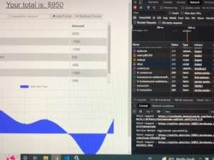

# Title

PWA-BUDGET-TRACKER

## Description

This purpose of this application is to create a budget tracker that will allow a user to input credits and debits with out without a data or internet connection.

Output is based on the acceptance criteria outlined in the Module 18 Assignment Overview [Module-19-assignment](https://courses.bootcampspot.com/courses/1181/assignments/23382?module_item_id=466409).

A sample of the expected layout is included in the Challenge outline.

## Table of Contents

* [Installation](#installation)
* [Usage](#usage)
* [License](#license)
* [Testing](#testing)
* [Credits](#credits)
* [Questions](#questions)

## Installation

* This application may be installed by deploying it at the Heroku web-site link indicated in this README.
  
## Usage

The site enables a user to maintain a budget via an application that can track transactions whether or not the user is connected to the internet. When connected, transactions update automatically.  When offline, transactions are stored in a cache which uses Service Workers to automatically update the application to reflect stored transactions once the user is back online.

## License

This application is covered under the MIT license.  [MIT license link](https://choosealicense.com/licenses/mit/)

## Contributing

Please visit [Contributor Covenant website](https://contributor-covenant.org) for guidance or reach out directly using the contact informtion below.

## Testing

Before deployment, the app was tested at the localhost:3001 url; a console.log message declares whether or not service worker(s) have been successfully registered:

The three stages, installation, activation, and idling, may be further studied in the Application tab on the Inspection panel.

After adding a few transactions to the budget tracker app, the internet connection is sent offline using the "offline" option in the "No throttling" dropdown on the Network tab so that transactions may be made offline in order to test for the acceptance criteria.

After adding a few transactions while offline, the connection is restored and the page updated to show that the data stored while offline has persisted in the budget tracker.

## Credits

* The majority of the program coding is based on material in both the module 18 and module 19 lessons.
* Documentation for MongoDB and MongoDB Atlas [website](https://www.mongodb.com) and Mongoose [npm page](https://www.npmjs.com/package/mongoose)
* Stack Overflow [website](https://stackoverflow.com) provided a number of solutions to some of the issues I encountered that were not addressed in the lesson material and/or clarity for other items.

## Questions?

If you have any questions, please see my contact details below:

## GitHub Username

My GitHub Username is [github.com/lnd4812](https://github.com/lnd4812).  

## GitHub Repository

My GitHub repository link for this project is via this [Link](https://github.com/lnd4812/mod-19-pwa-budget-app.git)

## Application Heroku Link

Link for Heroku Deployment [heroku link url](https://polite-whistler-56053.herokuapp.com/)

App may be used as is on a mobile device by right-clicking next to url address on deployed page and clicking on "send to your devices".

## Contact information

To contact me directly, please email me at: <a hef="mailto:laureldavid64@gmail.com">laureldavid64@gmail.com</a>
